# Container 1 - Scraping container

Purpose is to scrape craigslist for images of renovated and unrenovated homes for training our CNN model.

The code in this container, will create two folders.

renovated and fixer_uppers.

Each of these folders will have subfolders within them, the subfolders have pictures of houses. 

# *Example images.*

Below are example pictures from two houses, one is a renovated house, the other is a fixer upper.

## Renovated Houses

<table>
  <tr>
    <td>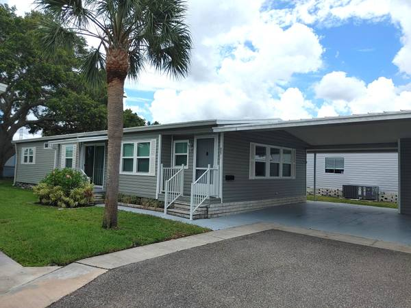</td>
    <td>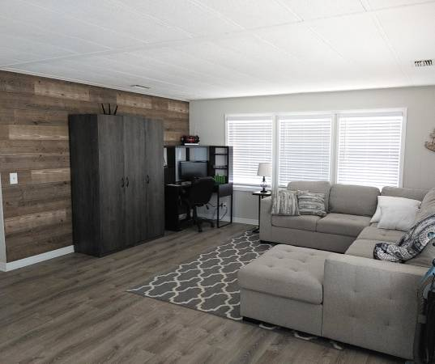</td>
    <td>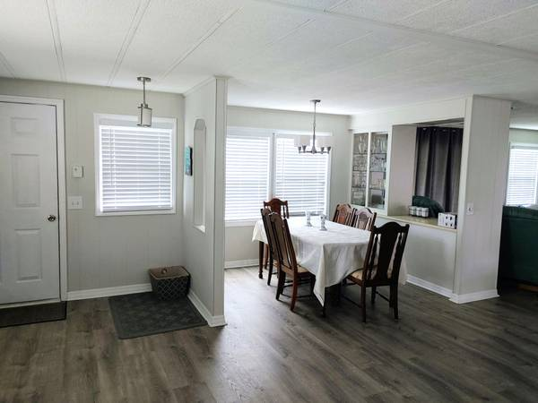</td>
  </tr>
  <tr>
    <td>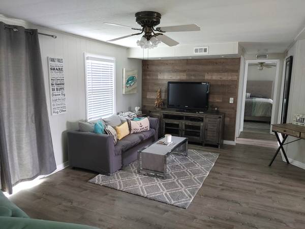</td>
    <td>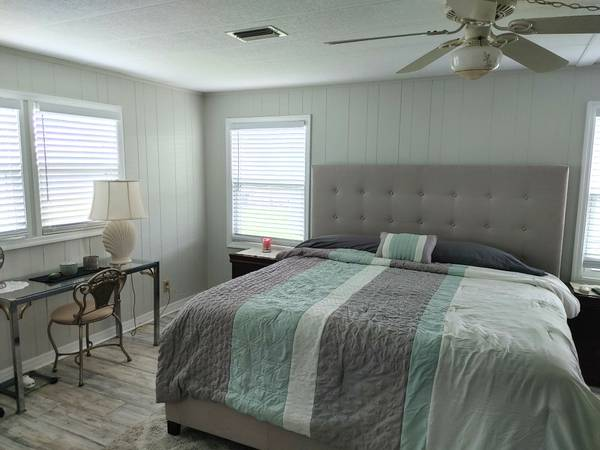</td>
    <td>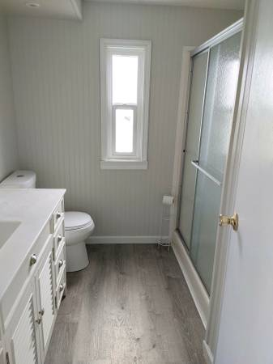</td>
  </tr>
</table>

## Fixer Uppers

<table>
  <tr>
    <td>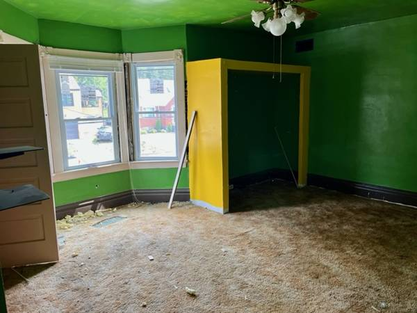</td>
    <td>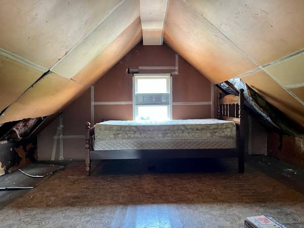</td>
    <td>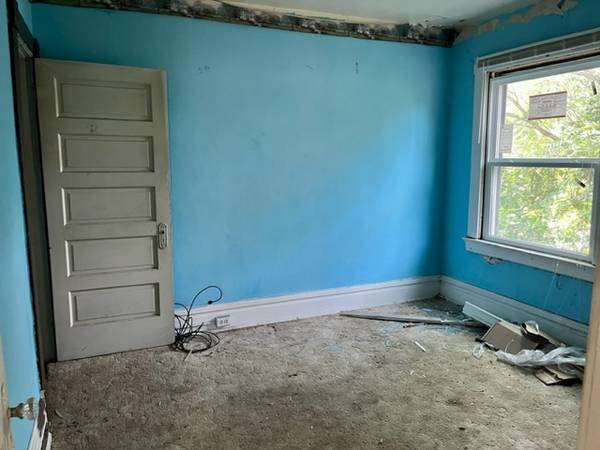</td>
  </tr>
  <tr>
    <td>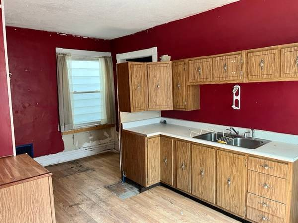</td>
    <td>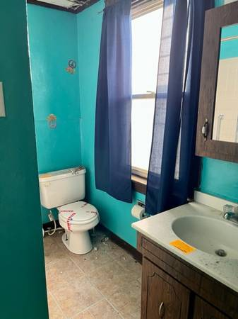</td>
  </tr>
</table>
